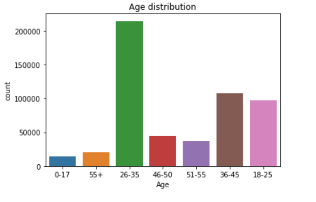
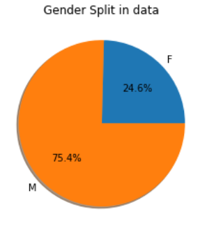
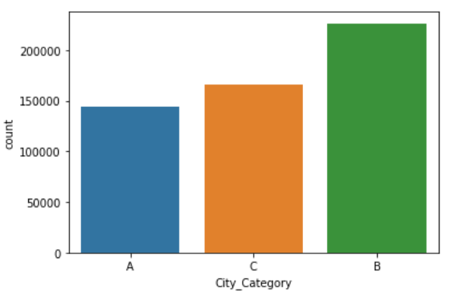
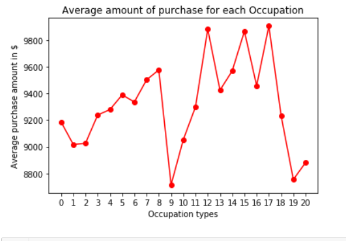
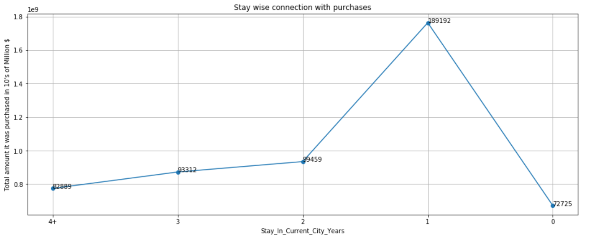
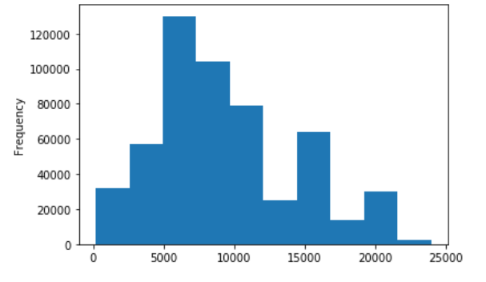

# Black-Friday-Sales-prediction
A retail company “ABC Private Limited” wants to understand the customer purchase behaviour (specifically, purchase amount) against various products of different categories. 
They have shared purchase summary of various customers for selected high volume products from last month.
The data set also contains customer demographics (age, gender, marital status, city_type, stay_in_current_city), product details (product_id and product category) 
and Total purchase_amount from last month.  Now, they want to build a model to predict the purchase amount of customer against various products which will help them 
to create personalized offer for customers against different products.

## Data

- Variable	(Definition), User_ID	(User ID), Product_ID	(Product ID),
- Gender	(Sex of User),
- Age	(Age in bins),
- Occupation	(Occupation (Masked)),
- City_Category	(Category of the City (A,B,C)),
- Stay_In_Current_City_Years	(Number of years stay in current city),
- Marital_Status	(Marital Status),
- Product_Category_1	(Product Category (Masked)),
- Product_Category_2	(Product may belongs to other category also (Masked)),
- Product_Category_3	(Product may belongs to other category also (Masked))
- Purchase	(Purchase Amount (Target Variable))

## Performence metrics

 As a part of predicting the continous varaible- root mean squared error (RMSE). RMSE is very common and is a suitable general-purpose error metric. Compared to the Mean Absolute Error, RMSE punishes large errors:
  RMSE= sqrt(sum(y-yhat)/n)
Where y hat is the predicted value and y is the original value.

## Steps considered

 - Data understanding and cleaning
 - EDA
 - Preparing the data
 - Base Model
 - Parametric Tuning    - RMSE

## EDA (Univariate and Bivariate analysis)

### Age & Gender

Inference
- Count of Male and Purchase sum is high 
- so we need to focus on them more with respect to offers
- If you observe here the puchase in the age group of 51-55 is comparatively higher with only 7%
- 26-35 age group where they contribute around 40% and sum of their purchases are more even though they are small- (Unmarried)
- While Unmarried are more in the contribution

### City

Inference:
- Even the number of count in the city b is more, purchase wise City C is contributing more.

### Marital Status

Inference

- Unmarried count is more with both Male and Female genders - Overall purchase amount is same
- No special concentration required, show equal importance

### Occupation

Inference
- Number of more counts in occuptation doesn't contribute more in the purchase amount
- Mean value of purchase value for occuptation 8 & 15 is more compartievly to the number of counts(Heavy Spenders)
- More effort on the less occupation (8&15) coulld generate more purchases
- Occupation 11 to 18 looks like a target are to focus in terms of raising puchases
- On other hand We can concentrate is there a possiblity of increasing the more count occupation to contribute to purchase
- Occupation 4 which is of more count as more number of youngsters- We can focus on the product of their interest in relation to their occupation
- Age group"26-35" are almost high in every categories as they contribute 40% of the total ages, yet the puchase amount is less if we can attract them we can surely increase the   sales by 5-10%

### Stay_in_years

Inference
- Here you can observe that the person staying 1 year are on the exploration state
- As the stay increases the purchase amount decreases maybe they have got all the stuff needed are we need to understand there requirements

### Purchases

Inference- 
- Purchase peak is arround 5000 and 10000 more in relation to the count

### Data_Cleaning process (refer the jupyter file)

- Mapping the User_ID based on the importance for the top 20 rather than excluding them totally

### Model and Performance achieved

- Gradient Boosting
- RMSE Score- 3054.56

